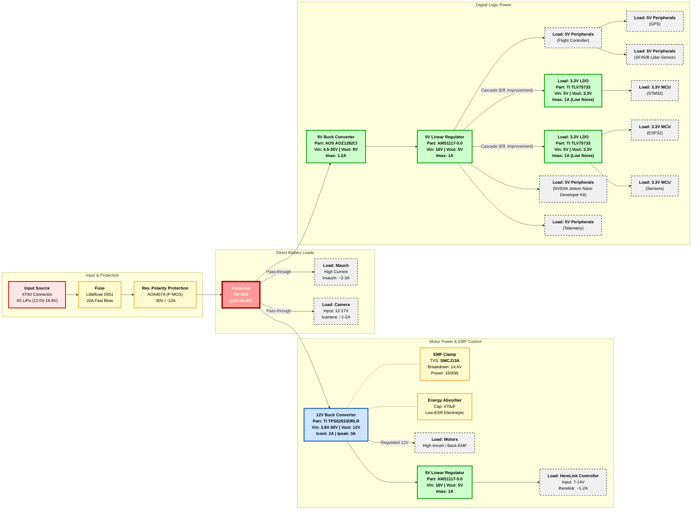

```mermaid
graph LR
    %% --- ENHANCED STYLES ---
    classDef input fill:#ffe6e6,stroke:#cc0000,stroke-width:3px,color:#000;
    classDef hvBus fill:#ff9999,stroke:#990000,stroke-width:5px,color:#fff,font-weight:bold;
    classDef reg12 fill:#cce5ff,stroke:#0047ab,stroke-width:3px,color:#000,font-weight:bold;
    classDef reg5 fill:#ccffcc,stroke:#009900,stroke-width:3px,color:#000,font-weight:bold;
    classDef load fill:#f0f0f0,stroke:#333333,stroke-width:2px,stroke-dasharray: 5 5,color:#000;
    classDef protect fill:#fffacd,stroke:#ff8c00,stroke-width:2px,color:#000;

    %% --- INPUT STAGE ---
    subgraph INPUT_STAGE [Input & Protection]
        BAT["<b>Input Source</b><br/>XT60 Connector<br/>4S LiPo (12.0V-16.8V)"]:::input
        FUSE["<b>Fuse</b><br/>Littelfuse 0451<br/>20A Fast Blow"]:::protect
        PMOS["<b>Rev. Polarity Protection</b><br/>AO4407A (P-MOS)<br/>-30V / -12A"]:::protect
    end

    %% --- MAIN BUS ---
    BUS_HV["Protected<br/>HV Rail<br/>(12V-16.8V)"]:::hvBus

    %% --- CONNECTIONS ---
    BAT --> FUSE --> PMOS --> BUS_HV

    %% --- HIGH POWER LOADS ---
    subgraph HV_LOADS [Direct Battery Loads]
        MOOK["<b>Load: Mauch</b> <br/>High Current<br/>Imauch: ~2-3A"]:::load
        CAM["<b>Load: Camera</b><br/>Input: 12-17V<br/>Icamera: ~1-2A"]:::load
        BUS_HV -->|Pass-through| MOOK
        BUS_HV -->|Pass-through| CAM
    end

    %% --- 12V MOTOR REGULATION ---
    subgraph MOTOR_STAGE [Motor Power & EMF Control]
        BUCK12["<b>12V Buck Converter</b><br/>Part: <b>TI TPS62933DRLR</b><br/>Vin: 3.8V-30V | Vout: 12V<br/>Icont: 2A | Ipeak: 3A"]:::reg12
        
        TVS["<b>EMF Clamp</b><br/>TVS: <b>SMCJ13A</b><br/>Breakdown: 14.4V<br/>Power: 1500W"]:::protect
        BULK["<b>Energy Absorber</b><br/>Cap: 470uF<br/>Low-ESR Electrolytic"]:::protect
        
        MOTORS["<b>Load: Motors</b><br/>High Inrush / Back-EMF"]:::load
        BUCK555["<b>5V Linear Regulator</b><br/>Part: <b>AMS1117-5.0</b><br/>Vin: 18V | Vout: 5V<br/>Imax: 1A"]:::reg5

        Herelink["<b>Load: HereLink Controller</b><br/>Input: 7-14V<br/>Iherelink: ~1-2A"]:::load
        
        BUS_HV --> BUCK12
        BUCK12 -->|Regulated 12V| MOTORS
        BUCK12 --> BUCK555
        BUCK555 -->  Herelink
        BUCK12 -.- TVS
        BUCK12 -.- BULK
    end

    %% --- LOGIC REGULATION ---
    subgraph LOGIC_STAGE [Digital Logic Power]
        BUCK5["<b>5V Linear Regulator</b><br/>Part: <b>AMS1117-5.0</b><br/>Vin: 18V | Vout: 5V<br/>Imax: 1A"]:::reg5
        BUCK9["<b>9V Buck Converter</b><br/>Part: <b>AOS AOZ1282CI</b><br/>Vin: 4.5-36V | Vout: 9V<br/>Imax: 1.2A"]:::reg5
        LDO33["<b>Load: 3.3V LDO</b><br/>Part: <b>TI TLV75733</b><br/>Vin: 5V | Vout: 3.3V<br/>Imax: 1A (Low Noise)"]:::reg5
        LDO333["<b>Load: 3.3V LDO</b><br/>Part: <b>TI TLV75733</b><br/>Vin: 5V | Vout: 3.3V<br/>Imax: 1A (Low Noise)"]:::reg5

        FC["<b>Load: 5V Peripherals</b><br/>(Flight Controller)"]:::load
        GPS["<b>Load: 5V Peripherals</b><br/>(GPS)"]:::load
        COMP["<b>Load: 5V Peripherals</b><br/>(NVIDIA Jetson Nano Developer Kit)"]:::load
        LIDAR["<b>Load: 5V Peripherals</b><br/>(SF45/B  Lidar Sensor)"]:::load
        TEL["<b>Load: 5V Peripherals</b><br/>(Telemetry)"]:::load

        MCUST["<b>Load: 3.3V MCU</b><br/>(STM32)"]:::load
        MCUES["<b>Load: 3.3V MCU</b><br/>(ESP32)"]:::load
        MCUESS["<b>Load: 3.3V MCU</b><br/>(Sensors)"]:::load

        BUS_HV --> BUCK9
        BUCK9 --> BUCK5
        BUCK5 -->|"Cascade (Eff. Improvement)"| LDO333
        LDO333 --> MCUESS
        LDO33 --> MCUST
        LDO333 --> MCUES 
        BUCK5 --> COMP
        BUCK5 --> TEL
        BUCK5 -->|"Cascade (Eff. Improvement)"| LDO33
        BUCK5--> FC
        FC --> GPS
        FC --> LIDAR


    end
    click BAT "https://www.hobbytown.com/gens-ace-4s-lipo-battery-60c-14.8v-7200mah-gea72004s60d/p1336145" "Gens Ace 4S LiPo Battery 60C Datasheet"
    click FUSE "https://www.lcsc.com/product-detail/C178980.html?s_z=n_0451020.MRL" "Littelfuse 0451020.MRL Datasheet"
    click PMOS "https://www.lcsc.com/product-detail/C16072.html?s_z=n_AO4407A" "AO4407A (P-MOS) Datasheet"
    click BUCK9 "https://www.lcsc.com/product-detail/C111916.html" "AOS AOZ1282CI Datasheet"
    click TVS "https://www.lcsc.com/product-detail/C43060567.html?s_z=n_SMCJ13A" "RUILON SMCJ13A Datasheet"
    click BULK "https://www.lcsc.com/product-detail/C127917.html?s_z=n_35PX470MEFC10X12.5" "Rubycon 35PX470MEFC10X12.5 Datasheet"
    click BUCK12 "https://www.lcsc.com/product-detail/C3200405.html?s_z=n_buck%20convertor" "TI TPS62933DRLR Datasheet"
    click BUCK5 "https://www.lcsc.com/product-detail/C880753.html" "AMS1117-5.0 Datasheet"
    click BUCK555 "https://www.lcsc.com/product-detail/C880753.html" "AMS1117-5.0 Datasheet"
    click LDO33 "https://www.lcsc.com/product-detail/C485517.html?s_z=n_%2520TI%2520TLV75733" "TI TLV75733PDBVR Datasheet"
    click LDO333 "https://www.lcsc.com/product-detail/C485517.html?s_z=n_%2520TI%2520TLV75733" "TI TLV75733PDBVR Datasheet"
    click MOOK "https://mauch-electronic.com/products/016-pl-2-6s-bec-2x5-35v-with-cfk-enclosure" "Mauch Datasheet"
    click CAM "https://siyi.biz/siyi_file/A8%20mini/A8%20mini%20User%20Manual%20v1.6.pdf" "Open Siyi A8 Manual"
    click Herelink "https://docs.cubepilot.org/user-guides/herelink/herelink-overview" "Open Herelink Guide"
    click FC "https://ardupilot.org/copter/docs/common-thecubeorange-overview.html" "Open Orange Cube Overview"
    click COMP "https://components101.com/development-boards/nvidia-jetson-nano-developer-kit" "Open Jetson Nano Specs"
    click GPS "https://docs.cubepilot.org/user-guides/here-3/here-3-manual" "Open Here3+ Manual"
    click LIDAR "https://acroname.com/sites/default/files/assets/sf45_-_lidar_datasheet_-_rev_1.pdf?srsltid=AfmBOoq0fV022RsXT6ty4rW7s-S2lTgYSgzYFJVHjju96_jtzy3MebCW" "Open SF45 LiDAR Datasheet"
    click TEL "https://files.rfdesign.com.au/Files/documents/RFD900x%20DataSheet%20V1.2.pdf" "Open RFD900x Datasheet"
    click MCUST "https://www.st.com/en/microcontrollers-microprocessors/stm32-32-bit-arm-cortex-mcus.html" "Open STM32 Page"
    click MCUES "https://www.espressif.com/en/products/socs/esp32" "Open ESP32 Page"
    click RC "https://www.spektrumrc.com/product/dsm2-ar6200-6-channel-receiver-ultralite/SPMAR6200.html" "Open Spektrum AR6200 Page"
    click LDOH "https://www.lcsc.com/product-detail/C507141.html?s_z=n_LM7809" "HGSEMI LM7809T Datasheet"
```